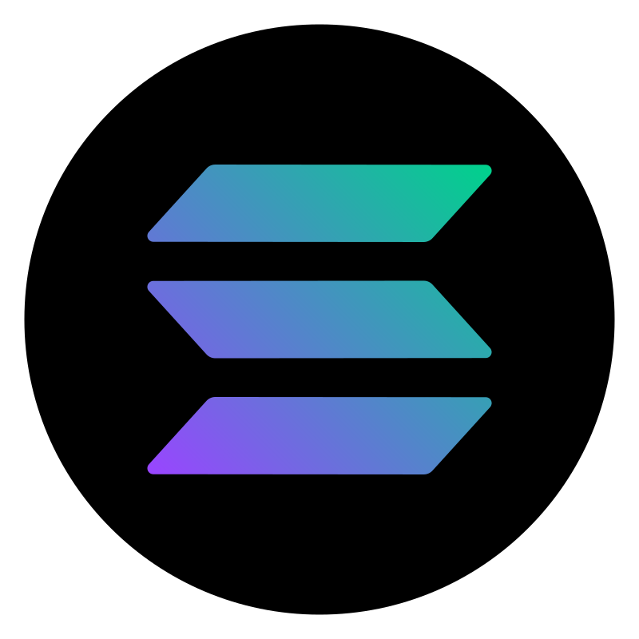

  

<h1 align="center"></h1>

<table>
  <tr>
    <td align="center" width="96">
      
       TypeScript
    </td>
    <td align="center" width="96">
      
       Go
    </td>
    <td align="center" width="96">
      
       Rust
    </td>
    <td align="center" width="96">
      
       JavaScript
    </td>
    <td align="center" width="96">
      
       Python
    </td>
    <td align="center" width="96">
      
       NodeJs
    </td>
    <td align="center" width="96">
      
       React
    </td>
    <td align="center" width="96">
      
       Vue
    </td>
    <td align="center" width="96">
      
       Sass
    </td>
  </tr>
  <tr>
    <td align="center" width="96"> 
      
       Docker
    </td>
    <td align="center" width="96">
      
       Kubernetes
    </td>
    <td align="center"  width="96">
      
       Debian
    </td>
    <td align="center"  width="96">
      
       RHEL
    </td>
    <td align="center" width="96">
      
       Powershell
    </td>
    <td align="center"  width="96">
      
       MySQL
    </td>
    <td align="center" width="96">
      
       Grafana
    </td>
    <td align="center" width="96">
      
       Prometheus
    </td>
    <td align="center" width="96">
      
       Thanos
    </td>
  </tr>
</table>

<table style="font-family:sansserif">
  <tr>
    <td align="center" width="96">
      
       Casper
    </td>
    <td align="center" width="96">
      
       Solana
    </td>
    <td align="center" width="96">
      
       Ethereum
    </td>
    <td align="center" width="96">
      
       Binance
    </td>
    <td align="center" width="96">
      
       Terra
    </td>
    <td align="center" width="96">
      
       Polkadot
    </td>
    <td align="center" width="96">
      
       Polygon
    </td>
    <td align="center" width="96">
      
       Elrond
    </td>
    <td align="center" width="96">
      
       Avalanche
    </td>
  </tr>
</table>

|  |
| -------------------------------------------------------------------------------------------------------------------------------------------------------- |

<!-- |  |
| ------------------------------------------------------------------------------------------------------------------------------------------------------------------------------------------------------ | -->

|  |  |
| --------------------------------------------------------------------------------------------------------------------------------------------------------------------- | ------------------------------------------------------------------------------------------------------------------------------------------------------------------------------------------------- |

|  |  |
| ---------------------------------------------------------------------------------------------------------------------------------------------------------------------- | ------------------------------------------------------------------------------------------------------------------------------------------------------------------------------------------------ |
